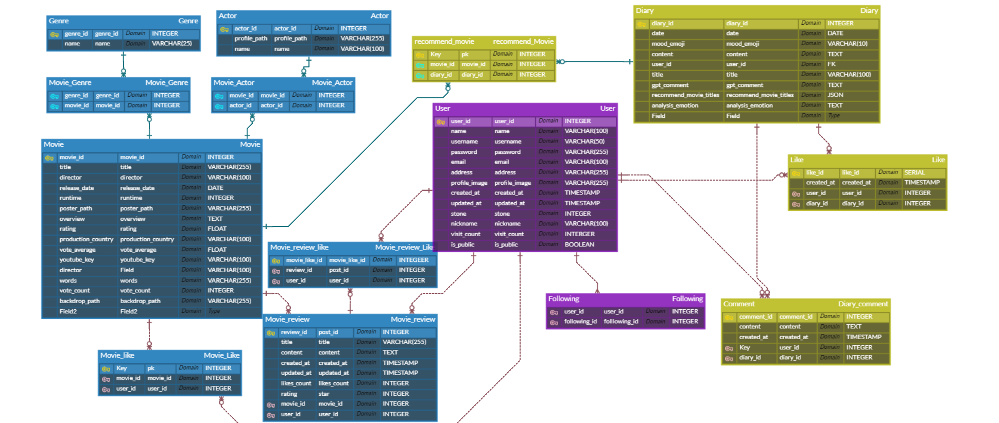

# 10-pjt
# 1. 팀원 정보 및 업무 분담 내역
- 유지인
    - 주요 업무 : 프론트엔드 및 CSS
    
- 이가람
    - 주요 업무 : 백엔드

##### 주요 업무는 위와 같고, 백엔드 과정을 다 끝내고 나서는 vue에서 처리하는 부분은 같이 하였습니다. 전반적인 CSS는 유지인 팀원이 담당하였습니다. 

# 2. 목표 서비스 구현 및 실제 구현 정도
- sns와 블로그 처럼 자신의 페이지에 일기를 쓰고 이웃 목록을 보여주고 방문자 수도 나타내어 자신만의 페이지를 보여주는 것이 저희의 큰 틀이었습니다. 
- drf와 vue를 연동시킨 프로젝트
- 주 메인 서비스는 OPEN AI API를 통해 프롬프트 엔지니어링을 하고 그것을 통해 일기를 분석하고 사용자의 감정을 분석해 그 날의 감정에 맞는 영화를 추천해주는 서비스입니다. 저희가 목표로 했던 일기 분석 -> 감정 추출 -> 감정에 따라 영화 2개 추출의 과정은 저희가 만든 프롬프트를 통해 실제 구현을 했습니다. 이 AI를 drf와 vue와 연동시켜 실제 홈페이지 화면의 띄우는 것도 구현하였습니다.  
- OTT 정보 가져오는 것과 장르별로 영화를 분류하는 것을 구현하지 못했습니다.
- 팔로우, 좋아요 기능과 공개/비공개 여부, 검색 기능(공백 처리, 자동 완성) 부분에서는 생각한 것들은 구현했습니다.


# 3. 데이터베이스 모델링 (ERD) : 


# 4. 영화 추천 알고리즘에 대한 기술적 설명:
**돌담뮤비디아의 영화 추천 시스템 기술적 설명**

#### 돌담뮤비디아는 사용자가 작성한 일기를 분석하여 감정에 맞는 영화를 추천하는 시스템을 제공합니다. 이 영화 추천 기능은 OpenAI API를 활용하여 자연어 처리(NLP)를 수행하며, 사용자의 감정 상태에 맞춰 두 가지 영화를 추천합니다: 하나는 감정을 반영하는 영화, 다른 하나는 사용자의 감정과 반대되는 영화입니다. 이러한 접근 방식은 사용자가 자신의 감정 상태를 더 깊이 이해하고 그에 따라 감정적 위안을 얻거나 기분 전환을 할 수 있는 기회를 제공합니다.

### 1. 데이터 준비 및 감정 분석
- **JSON 파일을 통해 영화 데이터 준비**: 시스템은 `updated_movies.json` 파일에서 영화 목록을 로드합니다. 이 과정에서 영화 제목을 정리하여 불필요한 특수문자를 제거합니다.
- **일기 텍스트 입력**: 사용자가 작성한 일기 내용을 `gpt_recommend()` 함수에 전달하여 감정 분석을 수행합니다.
- **감정 분류 및 추천 로직**: OpenAI API를 사용하여 일기의 감정을 분석합니다. 감정 분석 결과는 기쁨, 슬픔, 분노, 우울, 차분, 흥분의 6가지로 분류되며, 각각의 감정에 맞는 영화 장르가 정의되어 있습니다. API는 일기의 감정을 감지하고 그 감정에 적합한 영화 장르에서 추천 영화를 선택합니다.

### 2. 영화 추천 생성
- **프롬프트 구성 및 OpenAI 호출**: 사용자의 감정 상태를 기반으로 하는 영화 추천을 위해 OpenAI API와의 대화형 채팅 모델을 호출합니다. API 요청은 GPT 모델에 감정 분석 및 영화 추천을 위한 프롬프트를 전달하여 이루어집니다. 모델은 추천 영화 두 편을 제공하며, 감정 상태와 조화를 이루는 영화와 반대되는 영화 각 한 편씩을 추천합니다.
- **추천 응답 처리**: 모델에서 반환된 응답은 감정 분석 결과, 추천 영화 제목, 추천 이유, 그리고 일기에 대한 리뷰를 포함합니다. 이 데이터는 JSON 형식으로 정리되어 데이터베이스에 저장됩니다.

### 3. 다이어리 작성 및 영화 추천 저장
- **다이어리 저장 로직**: 사용자가 새로운 일기를 작성하고 저장하면, 시스템은 일기의 감정 분석 결과와 추천 영화 정보를 `Diary` 모델에 저장합니다. 영화 제목을 기반으로 데이터베이스에서 실제 영화 객체를 가져와 추천 영화 목록을 다이어리 객체에 추가합니다. 또한, 추천 이유와 GPT의 코멘트를 함께 저장하여 사용자가 일기를 돌아보며 감정적 공감을 느낄 수 있도록 합니다.
- **영화 추천 결과 저장**: 감정 분석에 따라 추천된 영화는 다이어리 모델의 `recommend_movie` 필드에 추가되고, 추천 이유는 딕셔너리 형태로 `recommend_reasons`에 저장됩니다. 이 모든 정보는 사용자에게 JSON 형태로 반환되어 프론트엔드에서 사용됩니다.

### 4. 에러 처리 및 트랜잭션 관리
- **API 호출 및 데이터베이스 저장 시 에러 처리**: OpenAI API 호출 중 발생할 수 있는 오류와 JSON 파일 파싱 시 발생하는 오류를 각각 예외 처리하여 시스템의 안정성을 높였습니다. 또한, 데이터베이스 작업은 트랜잭션을 통해 관리되며, 문제가 발생할 경우 롤백하여 데이터의 무결성을 보장합니다.

이와 같은 영화 추천 로직은 사용자의 감정을 존중하고 공감할 수 있는 추천을 목표로 하고 있습니다. 이 시스템은 단순히 영화를 추천하는 것이 아니라, 사용자와의 감정적 연결을 중요시하며 사용자 개개인에게 맞춤형 경험을 제공합니다.


# 5. 핵심 기능에 대한 설명
- 프롬프트 엔지니어링을 통한 AI의 영화 추천 
- 마이 페이지 다이어리 공개/비공개 여부
- 캘린더 생성 후, 일기 작성 
    - 당일에만 작성 가능하고, 당일이 아니면 삭제는 가능하지만 수정은 불가
    - 수정 후에도 새로운 영화 추천

# 6. 생성형 AI를 활용한 부분
- 생성형 AI를 통해 많은 도움을 받았지만, AI에 의존해서 안된다는 것을 느꼈습니다. AI의 도움을 받은 코드를 이해하지 않고 쓴다면 유지보수 하는데 있어서 어려움도 생기고, 똑같은 기능을 다시 구현할려고 할 때 원할하지 않을 수 있다는 점을 느꼈습니다.

# 7. 느낀점(어려웠던 점, 후기 등등)
- 유지인 

 - 장고(Django)와 Vue.js를 활용한 프로젝트였는데, 특히 두 기술 간의 연결고리가 부족한 점이 처음에는 큰 난관이었습니다. 장고와 Vue를 통합하는 과정에서 데이터 전달, 상태 관리, 라우팅 등이 제대로 연결되지 않아서 어려움을 겪었고, 이 문제를 해결하기 위해 많은 시간과 노력을 들였다.

처음에는 각 컴포넌트를 Vue의 `defineProps`로 정의하여 데이터를 전달했는데, 이로 인해 컴포넌트 간의 상태 관리가 생각보다 복잡해졌습니다. 특히, 한 컴포넌트에서 수정을 하면 변경된 사항이 즉시 뷰에 반영되지 않고, 새로고침 후에야 반영되는 문제가 발생했습니다. 이를 해결하기 위해 `onBeforeRouterUpdate` 훅을 사용하여 라우터가 업데이트되기 전에 상태를 갱신하는 방법을 적용했습니다. 덕분에 사용자가 상태 변경을 반영하는 데 있어서 더 이상 새로고침을 하지 않아도 되었고, 원활한 사용자 경험을 제공할 수 있었습니다.

또 다른 어려운 점은 한 컴포넌트 안에 생성, 수정, 상세 보기 모달을 모두 구현하면서 발생했습니다. 각 모달의 클래스 이름을 따로 정의해줘야 했기 때문에 CSS가 중복되거나 적용이 꼬이는 문제도 있었습니다. 특히, 스타일을 일관되게 유지하면서도 각 모달의 기능에 맞는 레이아웃을 구현하는 것이 매우 까다로웠습니다. 이 부분에서 더 깔끔하고 재사용 가능한 방식으로 코드를 작성하는 것이 중요하다는 점을 다시 한번 깨달았습니다.

로그아웃, 로그인 유지 및 권한 관리 기능을 구현하는 데 어려움이 있었습니다. 사용자 인증과 권한이 중요한 부분이라 신경을 많이 썼는데, 특히 사용자가 로그인 후 페이지를 새로고침해도 로그인 상태가 유지되는 기능을 구현하는 데 많은 시간과 노력이 필요했습니다. 세션 관리, 토큰 기반 인증을 처리하는 부분에서 예상보다 복잡한 문제들이 발생했지만, 결국 쿠키와 로컬 스토리지(localStorage)를 활용해 상태를 유지할 수 있었습니다. 권한 있는 사용자만 특정 작업을 할 수 있도록 처리하는 것도 까다로웠고, 사용자 역할에 따른 접근 제한을 세밀하게 설정하는 데 신경을 많이 썼습니다. 이 과정에서 보안적인 측면과 사용자 경험을 모두 고려해야 해서 많은 고민이 있었습니다.

또한, `counter.js`를 사용하는 데 있어서 조금 아쉬운 부분이 있었습니다. Vuex나 컴포넌트 내부에서 상태를 관리할 때 `counter.js`를 적극적으로 활용하지 못한 점이 아쉽습니다. 상태 관리를 보다 효율적으로 할 수 있었을 텐데, 그 부분에서 조금 더 시간을 투자했더라면 프로젝트의 관리가 더욱 쉬웠을 것 같습니다.

하지만 프로젝트를 진행하면서 백엔드에서 제공해준 API와 Serializer 덕분에 매우 큰 도움이 되었습니다. 장고에서는 데이터 직렬화 작업을 잘 처리해주었고, 이를 통해 프론트엔드에서 별도의 복잡한 로직 없이 쉽게 데이터를 받아올 수 있었습니다. 특히, 데이터 형식을 명확하게 정의하고, 필요한 필드만을 정확하게 가져올 수 있도록 해주셔서 프론트엔드 작업이 훨씬 수월해졌습니다. 백엔드 개발자에게 감사한 점은, 그들의 작업 덕분에 프론트엔드에서 비즈니스 로직에 집중할 수 있었고, API 연동이 원활하게 이루어져서 전체 시스템의 안정성을 크게 향상시킬 수 있었습니다.

- 이가람
```
ㅇㅇㅇd
```

